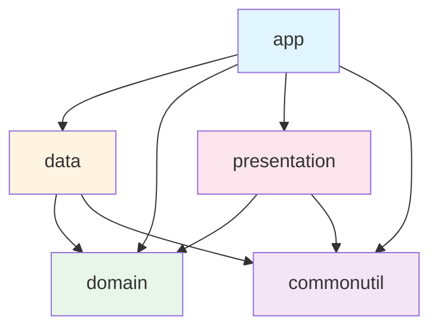

<div align="center">

# 🚪 넥스트룸 (NextRoom)

### 방탈출의 퀄리티를 한층 높여줄 힌트폰 앱

[](https://www.android.com)
[](https://android-arsenal.com/api?level=24)
[](https://kotlinlang.org)
[](LICENSE)

[](https://play.google.com/store/apps/details?id=com.nextroom.nextroom&hl=ko)


</div>

---

## 📱 프로젝트 소개

**넥스트룸**은 방탈출 사장님들을 위한 힌트폰 관리 서비스입니다.

방탈출 게임 진행시 사용하는 앱을 제공하며, 웹에서 테마와 힌트를 한 번에 관리할 수 있습니다.

### 링크

- **플레이스토어**: [playstore](https://play.google.com/store/apps/details?id=com.nextroom.nextroom&hl=ko)
- **웹사이트**: [nextroom.co.kr](https://nextroom.co.kr)
- **인스타그램**: [@team_nextroom](https://www.instagram.com/team_nextroom/)
- **사용 가이드**: [넥스트룸 사용 가이드](https://held-notebook-420.notion.site/134ed57b9c574733b31feab0ea5c36a5?pvs=4)

---

## ✨ 주요 기능

### 🎮 게임 관리
- **실시간 타이머**: 방탈출 게임 진행 시간 추적 및 관리
- **힌트 시스템**: 4자리 힌트 코드를 통한 체계적인 힌트 제공
- **진행률 추적**: 문제 진행률 실시간 모니터링
- **메모 기능**: 게임 중 필요한 메모를 그림으로 작성

### 🎨 커스터마이징
- **타이머 배경 설정**: 테마별 포스터로 타이머 배경 커스텀
- **이미지 조정**: 배경 이미지의 어두움과 위치 조정 가능
- **테마별 분위기**: 각 테마의 독특한 분위기로 몰입감 향상

### 🔐 보안 기능
- **앱 비밀번호**: 관리자만 게임을 시작할 수 있도록 보안 설정
- **지문 인증**: 생체 인증을 통한 빠르고 안전한 접근

### 💳 구독 관리
- **멤버십 시스템**: 월 구독 기반 서비스
- **힌트 이미지**: 구독 시 힌트와 이미지를 함께 제공
- **무제한 배경**: 구독자는 무제한 타이머 배경 등록 가능

---

## 📸 스크린샷

<div align="center">
  
  
  
</div>

---

## 🏗️ 아키텍처

### Clean Architecture with Multi-Module

이 프로젝트는 **Clean Architecture** 원칙을 따르며, 5개의 모듈로 구성되어 있습니다.



---

## 🔄 CI/CD

### GitHub Actions

**앱 배포와 알림 프로세스** 구축
- Feature 브랜치: Lint → Debug APK 빌드 → Firebase App Distribution → Slack 알림
- Release 브랜치: Lint → Release AAB 빌드 → Play Store 배포 (내부 테스트, 초안)

**자동으로 코드를 작성하고 검수**까지 완료하는 프로세스 구축
- 깃허브 이슈 등록 → Gemini API를 활용하여 자동으로 코드 작성 → PR push → Gemini로 코드 검수하여 리뷰 코멘트 작성

---

## 🛠️ 기술 스택

### Language & Platform
- **Kotlin** `1.9.10` - 100% Kotlin으로 작성
- **JVM Target** `17`
- **Min SDK** `24` (Android 7.0)

### Architecture & Design Pattern
- **Clean Architecture** - 계층 분리 및 의존성 규칙
- **Multi-Module** - 기능별 모듈 분리
- **MVI Pattern** - Orbit MVI를 활용한 단방향 데이터 흐름

### Jetpack & AndroidX
- **Navigation Component** `2.7.4` - 화면 전환 및 SafeArgs
- **Room** `2.5.2` - 로컬 데이터베이스 (KSP 적용)
- **DataStore** - 사용자 설정 저장
- **View Binding** - 타입 안전한 뷰 바인딩

### Dependency Injection
- **Hilt** `2.48` - 의존성 주입 (KAPT 사용)

### Networking
- **Retrofit** `2.9.0` - REST API 통신

### Asynchronous
- **Coroutines** `1.7.3` - 비동기 프로그래밍
- **Flow** - 반응형 데이터 스트림

### State Management
- **Orbit MVI** `6.0.0` - 상태 관리 및 사이드 이펙트 처리

### Firebase
- **Firebase BOM** `32.3.1`
  - Analytics - 사용자 행동 분석
  - Crashlytics - 크래시 리포팅
  - Remote Config - 원격 설정

### Billing & Authentication
- **Play Billing** `8.0.0` - 인앱 결제
- **Google Identity** - 구글 로그인

### Debugging (Debug Only)
- **Flipper** `0.200.0` - 네트워크, DB 디버깅
- **LeakCanary** `2.14` - 메모리 누수 감지
- **Timber** `5.0.1` - 로깅

---

## 📚 주요 개발 패턴

### State Management (Orbit MVI)

ViewModel에서 `BaseViewModel<STATE, SIDE_EFFECT>`를 상속:

```kotlin
@HiltViewModel
class ExampleViewModel @Inject constructor(
    private val repository: ExampleRepository
) : BaseViewModel<ExampleState, ExampleEvent>() {

    override val container: Container<ExampleState, ExampleEvent> =
        container(ExampleState())

    fun loadData() = intent {
        repository.getData()
            .onSuccess { data ->
                reduce { state.copy(data = data) }
            }
            .onFailure { error ->
                postSideEffect(ExampleEvent.ShowError(error))
            }
    }
}
```

---

## 📄 라이선스

```
MIT License

Copyright (c) 2025 Next Room

Permission is hereby granted, free of charge, to any person obtaining a copy
of this software and associated documentation files (the "Software"), to deal
in the Software without restriction, including without limitation the rights
to use, copy, modify, merge, publish, distribute, sublicense, and/or sell
copies of the Software, and to permit persons to whom the Software is
furnished to do so, subject to the following conditions:

The above copyright notice and this permission notice shall be included in all
copies or substantial portions of the Software.

THE SOFTWARE IS PROVIDED "AS IS", WITHOUT WARRANTY OF ANY KIND, EXPRESS OR
IMPLIED, INCLUDING BUT NOT LIMITED TO THE WARRANTIES OF MERCHANTABILITY,
FITNESS FOR A PARTICULAR PURPOSE AND NONINFRINGEMENT. IN NO EVENT SHALL THE
AUTHORS OR COPYRIGHT HOLDERS BE LIABLE FOR ANY CLAIM, DAMAGES OR OTHER
LIABILITY, WHETHER IN AN ACTION OF CONTRACT, TORT OR OTHERWISE, ARISING FROM,
OUT OF OR IN CONNECTION WITH THE SOFTWARE OR THE USE OR OTHER DEALINGS IN THE
SOFTWARE.
```

<div align="center">

Made with ❤️ by Next Room Team

[⬆️ Back to top](#-넥스트룸-nextroom)

</div>
